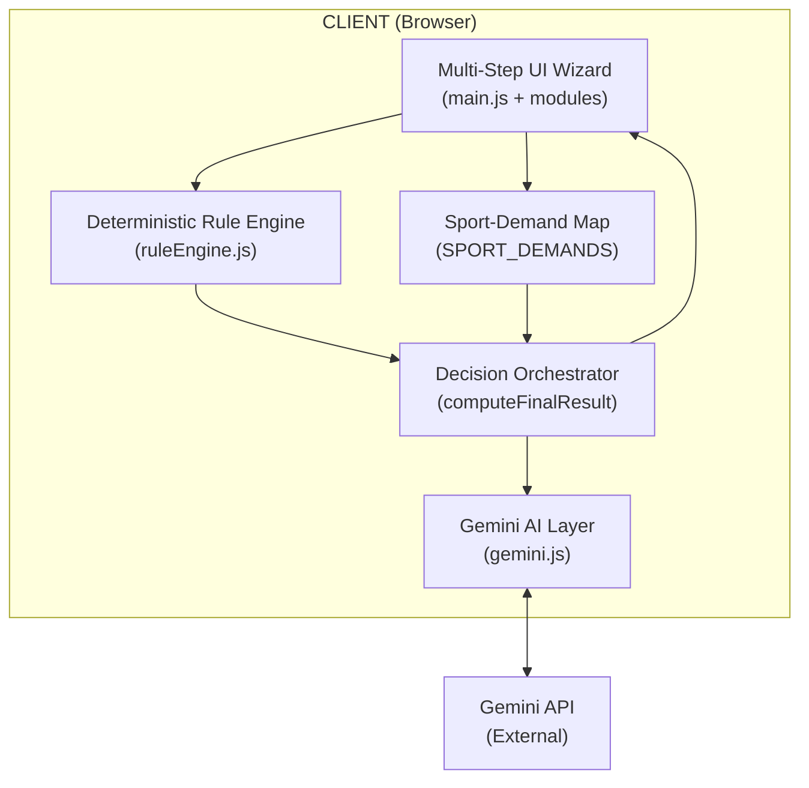
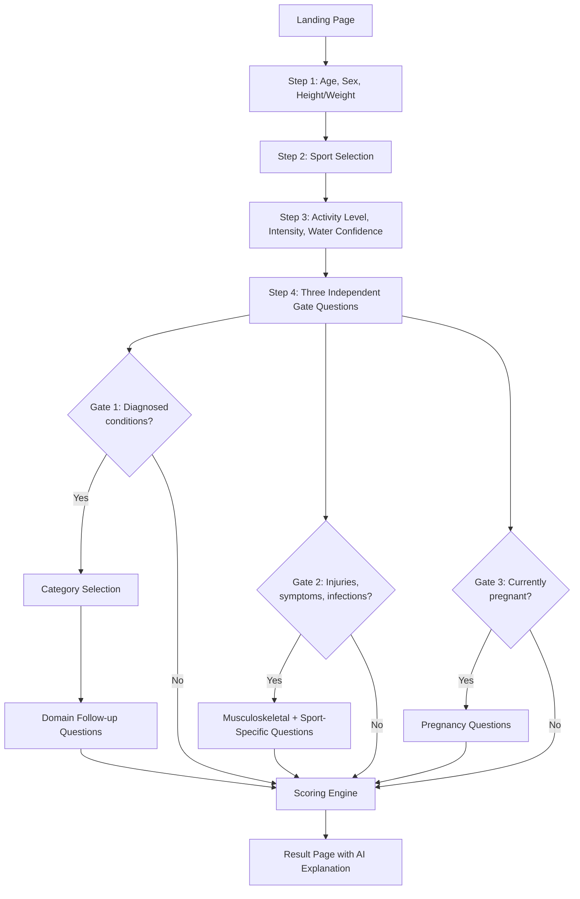
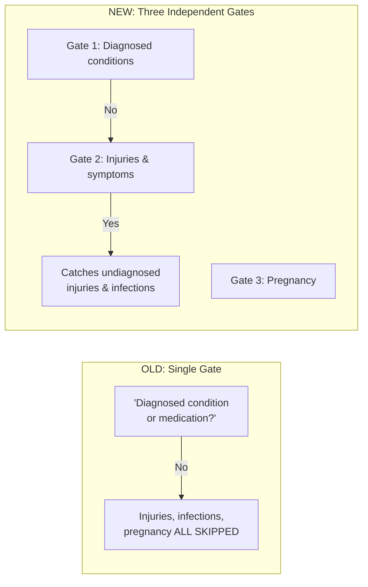
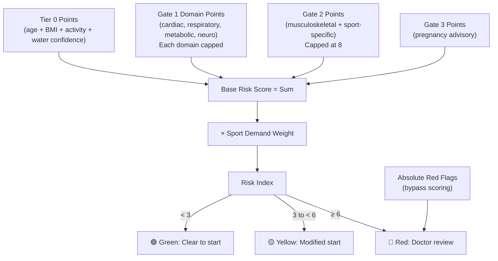
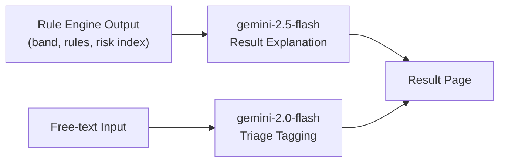
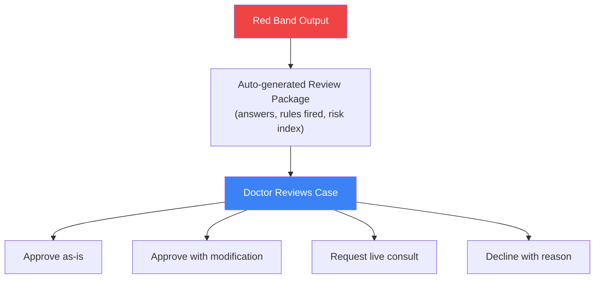

# Architecture & Design Document (v3)

## System Architecture

## Screening Flow (v3 — Three Independent Gates)

## Why Three Gates Instead of One

**Key example**: A 19-year-old with an ACL reconstruction 8 months ago correctly answers "No" to Gate 1 (not a "diagnosed condition" in their mind) but "Yes" to Gate 2 (injury in the last 12 months). Under the old single-gate design, this case would have reached a false Green.

## Scoring Pipeline

## AI Architecture

### Model Responsibilities

| Model | Task | Decides Band? |
|-------|------|:---:|
| gemini-2.0-flash | Free-text triage tagging | ❌ |
| gemini-2.5-flash | Result explanation generation | ❌ |
| Rule Engine | All scoring and band assignment | ✅ |

## Doctor-in-the-Loop (Demo)

> **Note**: In this demo, Red-band results show a banner indicating doctor review would be required. The actual doctor console is not implemented.

## Data Flow

All data stays client-side. No backend server exists. The only external call is to the Gemini API for generating explanations.

## Security Note

The Gemini API key is embedded client-side for demo purposes. Production would route through a backend proxy with proper key management.
