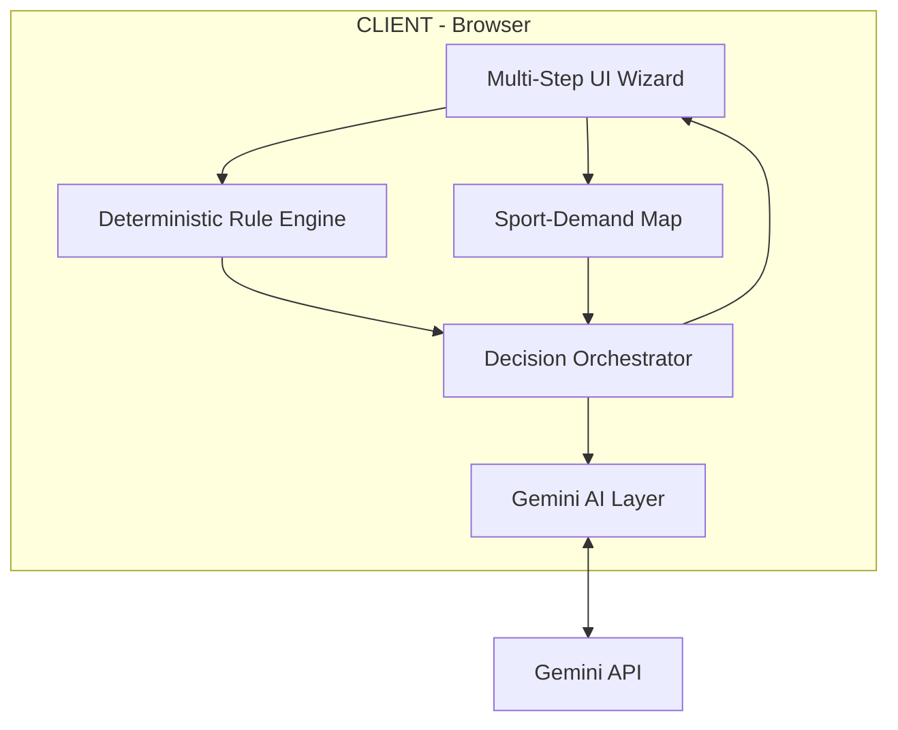
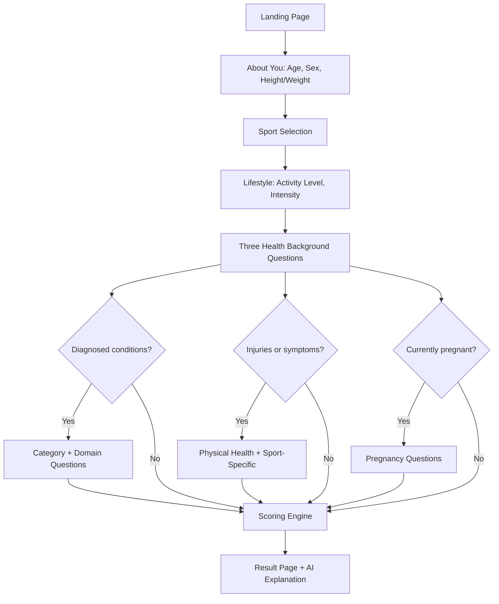

# Sports Readiness Adviser

An intelligent, evidence-based pre-participation screening tool that helps users assess their readiness to start a sport. Built with a deterministic rule engine, cascading multi-model Gemini AI, and a premium dark-themed UI.

> **Demo**: This is a functional demo showcasing the screening flow, scoring engine, and AI-powered explanations for **Badminton** and **Swimming**.

---

## Table of Contents

- [Overview](#overview)
- [Architecture](#architecture)
- [Screening Flow](#screening-flow)
- [Scoring Engine](#scoring-engine)
- [AI Integration](#ai-integration)
- [Design Decisions & Rationale](#design-decisions--rationale)
- [Tech Stack](#tech-stack)
- [Getting Started](#getting-started)
- [Testing](#testing)
- [Deployment](#deployment)
- [Project Structure](#project-structure)

---

## Overview

The Sports Readiness Adviser is a screening tool — not a diagnostic system — that stratifies risk and routes users using the same principles employed by sports medicine bodies worldwide. It answers the question: *"Given my health profile, is it safe for me to start this sport at this intensity?"*

### Key Principles

1. **Screening, not diagnosis** — The system stratifies risk and routes users; it never names a medical condition or prescribes treatment.
2. **Minimum viable questions** — Most users answer only 6 quick questions (Tier 0). Detailed follow-ups appear only when medically relevant.
3. **Deterministic, auditable scoring** — A rule engine computes the result, so every recommendation traces back to exact inputs and thresholds. An LLM is used only to explain the result in plain language — it never decides the risk band.

### Research Foundations

The questionnaire structure, branching logic, and risk-stratification are modelled on established frameworks:

- **PAR-Q+ / ePARmed-X+** — The international standard pre-participation screening questionnaire
- **ACSM 2015 Preparticipation Screening Algorithm** — Stratifies by activity level, disease signs, and desired intensity
- **Sport-specific research** — Badminton injury epidemiology (lower-limb dominance), swimming water-safety guidance (seizure intervals, chlorine-induced bronchoconstriction)

---

## Architecture



### Component Responsibilities

| Component | Responsibility | Owns the decision? |
|-----------|---------------|-------------------|
| **Rule Engine** | Encodes PAR-Q+/ACSM-derived screening logic; computes base risk score | ✅ Yes — deterministic |
| **Sport-Demand Map** | Static lookup of cardio, joint, collision, thermal demand per sport/intensity | ✅ Yes — deterministic |
| **LLM Explainer** | Converts rule-engine output into plain language; never decides the band | ❌ No — language & UX only |
| **Decision Orchestrator** | Merges rule engine + sport-demand output into risk index and band | ✅ Yes — deterministic |

---

## Screening Flow (v3 — Three Independent Gates)

The questionnaire uses **progressive disclosure** — each step is a separate view. The user never sees upcoming questions.



### Three Independent Gates (v3 Design Correction)

A single medical gate was replaced with three independent gates, each worded to match how people actually describe their situation:

1. **Diagnosed conditions** — opens cardiac, respiratory, metabolic, neurological domains
2. **Injuries, symptoms & infections** — opens musculoskeletal + sport-specific extension (catches undiagnosed issues)
3. **Pregnancy** — asked directly to females of reproductive age, independent of other gates

### Question Layers

- **Universal** (all users): Age, sex, height/weight, sport, activity level, intensity, water confidence (swimming only)
- **Condition follow-ups** (gate 1 = Yes): Cardiac, Respiratory, Metabolic, Neurological
- **Physical health** (gate 2 = Yes): Generic musculoskeletal + sport-specific extension
- **Pregnancy** (gate 3 = Yes): Trimester, complications

---

## Scoring Engine

### Formula

```
Base Risk Score = Tier 0 points + Tier 1 domain points (capped per domain) + sport-specific extension points
Risk Index = Base Risk Score × Sport Demand Weight
Band = Green | Yellow | Red (based on risk index thresholds)
```

### Tier 0 Points

| Factor | Value | Points |
|--------|-------|--------|
| Age | Under 30 | +0 |
| Age | 30-45 | +1 |
| Age | 46-60 | +2 |
| Age | 60+ | +3 |
| BMI | Normal (18.5-24.9) | +0 |
| BMI | Under/Overweight | +1 |
| BMI | Obese (30+) | +2 |
| Activity | Regular (3+/wk) | +0 |
| Activity | Light (1-2/wk) | +1 |
| Activity | Sedentary | +2 |

**Maximum Tier 0 contribution: 7 points**

### Sport Demand Weights

| Sport | Intensity | Cardio | Impact/Joint | Collision | Thermal | Weight |
|-------|-----------|--------|-------------|-----------|---------|--------|
| Badminton | Recreational | Moderate | Moderate | Low | Moderate | **1.0** |
| Badminton | Competitive | High | High | Low | High | **1.5** |
| Swimming | Recreational | Moderate | Low | Low | Low | **0.8** |
| Swimming | Competitive | High | Low-Moderate | Low | Low | **1.2** |

### Band Thresholds

| Risk Index | Band | Meaning |
|-----------|------|---------|
| Below 3 | 🟢 Green | Clear to start at the requested intensity |
| 3 to <6 | 🟡 Yellow | Start with modifications; re-check in 4 weeks |
| 6 or above | 🔴 Red | Doctor review required before starting |

### Absolute Red Flags

Certain answers bypass scoring entirely and route straight to Red:

- Chest pain/breathlessness at rest or minimal exertion
- Cardiac event or procedure under 3 months ago
- Recurrent or unexplained fainting during exertion
- Seizure within last 6 months
- Seizure 6-12 months ago + swimming (drowning risk)
- Severe blood sugar episode requiring assistance
- Pregnancy with complications
- Recent surgery (<3 months) + badminton (high-impact)
- Recent ACL injury (<12 months) + competitive badminton

### Domain Caps

Each Tier 1 domain has a point cap to prevent mild flags from stacking unrealistically:

- Cardiovascular: 8 points
- Respiratory: 6 points
- Metabolic: 6 points
- Musculoskeletal: 6 points
- Neurological: 6 points
- Sport-specific: 8 points

---

## AI Integration

The system uses a **cascading multi-model** approach with Google's Gemini AI:

### Model 1: `gemini-2.0-flash` (Fast)
- **Purpose**: Free-text triage tagging
- **Use**: Tags user free-text health disclosures with urgency and category labels
- **Key constraint**: Never scores or decides the band

### Model 2: `gemini-2.5-flash` (Rich)
- **Purpose**: Result explanation generation
- **Use**: Converts the deterministic rule-engine output into warm, conversational, plain-language guidance
- **Key constraint**: Grounded strictly in the rules that fired — never invents factors
- **Fallback**: If the API is unavailable, a deterministic fallback explanation is provided

### Why This Split?

- The fast model handles quick, structured tasks (tagging)
- The richer model handles nuanced language generation where tone and empathy matter
- Neither model ever decides the risk band — that's always the deterministic rule engine

---

## Design Decisions & Rationale

### Why No Backend?
The rule engine is pure JavaScript — no server-side computation needed. Gemini API calls are made client-side. For a demo, this dramatically simplifies deployment (static hosting on GitHub Pages) while demonstrating the full screening flow.

### Why Deterministic Scoring?
This is the single most important design decision. An LLM hallucinating a medical clearance is the biggest liability exposure. By keeping all scoring deterministic and auditable, every output can be traced to exact inputs and thresholds. The LLM's role is limited to language — it explains, it never decides.

### Why Progressive Disclosure?
Users should never see questions they won't need to answer. The three independent gates mean ~70% of recreational users skip follow-ups entirely. Those who do answer follow-ups see only the domains they selected. This respects the user's time and reduces cognitive load.

### Why Three Gates Instead of One?
A single medical gate silently under-triggers for injuries people don't consider "diagnosed conditions," infections they manage themselves, and pregnancy (which isn't a diagnosis). Three independently-worded gates ensure an honest "No" to one never silently skips a genuinely relevant line of questioning.

### Doctor-in-the-Loop (Demo)
The full design specifies an async doctor review console. For this demo, Red-band results show a prominent banner indicating that doctor review would be the next step in a production system.

---

## Tech Stack

| Layer | Technology | Why |
|-------|-----------|-----|
| Build Tool | Vite | Fast, zero-config, optimized static output |
| Language | Vanilla JavaScript (ES modules) | No framework overhead for a wizard-style flow |
| Styling | Vanilla CSS | Full design control, dark theme with glassmorphism |
| AI | Gemini API (2.0-flash + 2.5-flash) | Cascading multi-model per requirements |
| Testing | Vitest | Native ESM support, fast, Vite-compatible |
| Deployment | GitHub Pages | Free, simple, static hosting |
| Fonts | Inter (Google Fonts) | Modern, highly readable UI font |

---

## Getting Started

### Prerequisites
- Node.js 18+
- npm

### Installation
```bash
git clone https://github.com/<your-username>/sports-readiness-adviser.git
cd sports-readiness-adviser
npm install
```

### Development
```bash
npm run dev
# Opens at http://localhost:5173/
```

### Build
```bash
npm run build
# Output in dist/
```

---

## Testing

The rule engine is covered by **35 tests** validating:

- BMI calculation and categorization
- Universal scoring (age, BMI, activity, water confidence)
- Sport demand profile weights
- Gate 1 absolute red flags and point scoring with domain caps
- Gate 2 injury/symptom scoring and sport-specific extensions
- Gate 3 pregnancy scoring
- Three-gate independence (the v3 core fix)
- **All 10 worked examples from the v3 design document**

```bash
npm test
```

```
 ✓ src/engine/ruleEngine.test.js (35 tests) 9ms

 Test Files  1 passed (1)
      Tests  35 passed (35)
```

---

## Deployment

The app is deployed as a static site on GitHub Pages.

```bash
npm run build
# Push the dist/ folder or configure GitHub Pages to build from the main branch
```

---

## Project Structure

```
sports-readiness-adviser/
├── Docs/                          # Design documents (NOT deployed)
├── index.html                     # Entry point
├── src/
│   ├── main.js                    # App orchestrator (step dispatch)
│   ├── style.css                  # Design system (dark theme, glassmorphism)
│   ├── ui/
│   │   ├── helpers.js             # Shared UI utilities (header, nav, progress)
│   │   ├── steps.js               # Landing, basic info, sport, activity steps
│   │   ├── gates.js               # Three gate questions + domain follow-ups
│   │   └── result.js              # AI-powered result page
│   ├── engine/
│   │   ├── ruleEngine.js          # Deterministic scoring (v3 three-gate)
│   │   └── ruleEngine.test.js     # 35 tests incl. all v3 worked examples
│   ├── questionnaire/
│   │   └── questions.js           # Question definitions, options, metadata
│   └── ai/
│       └── gemini.js              # Gemini API (2.0-flash + 2.5-flash)
├── ARCHITECTURE.md                # Full architecture with mermaid diagrams
├── .gitignore
├── package.json
└── README.md
```

---

## Disclaimer

This is a screening tool, not a medical diagnosis. It is designed to help users make an informed decision about starting a sport, using the same principles used by sports medicine bodies worldwide. If you have ongoing symptoms or concerns, please consult a doctor directly.

All point values, caps, and thresholds are a defensible starting model based on cited research, not a clinically validated scale. They should be reviewed by a qualified sports-medicine advisor before any production use.
